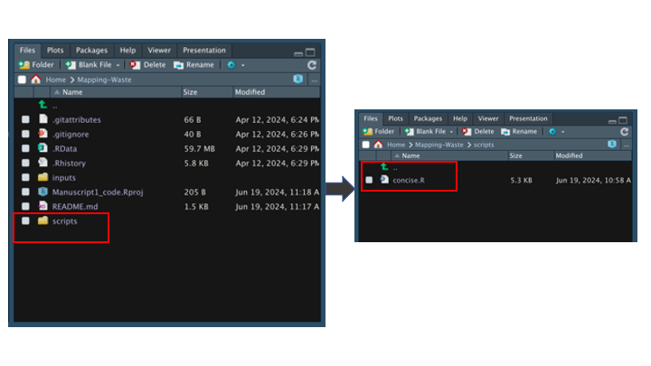

# **Mapping Waste Piles from Drone Imagery** 

## Overview

This project focuses on mapping waste piles using drone imagery. By leveraging machine learning techniques, we classify different segments of the imagery to identify and quantify waste piles. This README provides step-by-step instructions on setting up the environment, running the scripts, and understanding the results.

## Requirements

Before you begin, ensure you have met the following requirements:

-   R: This project requires R (version 4.0 or higher).
-   RStudio: Recommended for an integrated development environment.
-   Dependencies: The script installs required R packages automatically.

## Installation

Clone the repository (Official GitHub CLI):

`gh repo clone Kalondepatrick/Mapping-Waste`

Navigate to the project directory:

`cd concise/scripts`

Open RStudio and load the script Manuscript1_code.R.

`Install the pacman package (if not already installed):`

`install.packages("pacman")`

## Usage

To run the script and explore model building process:

1.  Open the Manuscript1_code.R script in RStudio.

Run the script by clicking the Run button in RStudio or by executing it in the R console:

`source('Manuscript1_code.R')`

2.  Check on the project files and open scripts/concise. Run the script:

{width="400"}

## Acknowledgements

Special thanks to the open-source community for the tools and packages used in this project. Thanks to the entire SPACES Project team (<https://spacesproject.stir.ac.uk/>).
